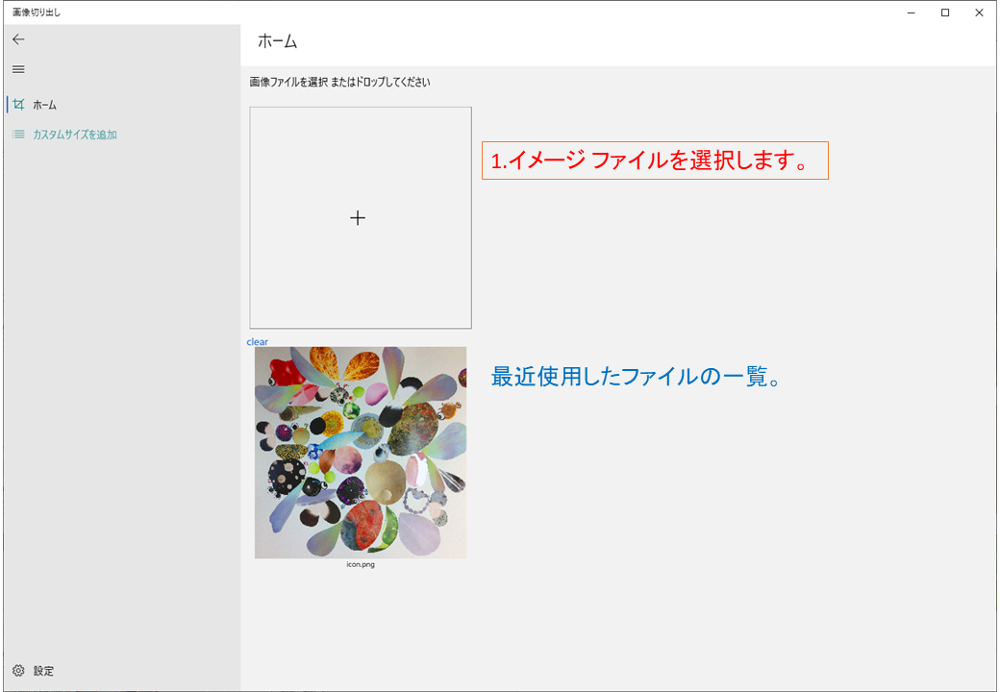
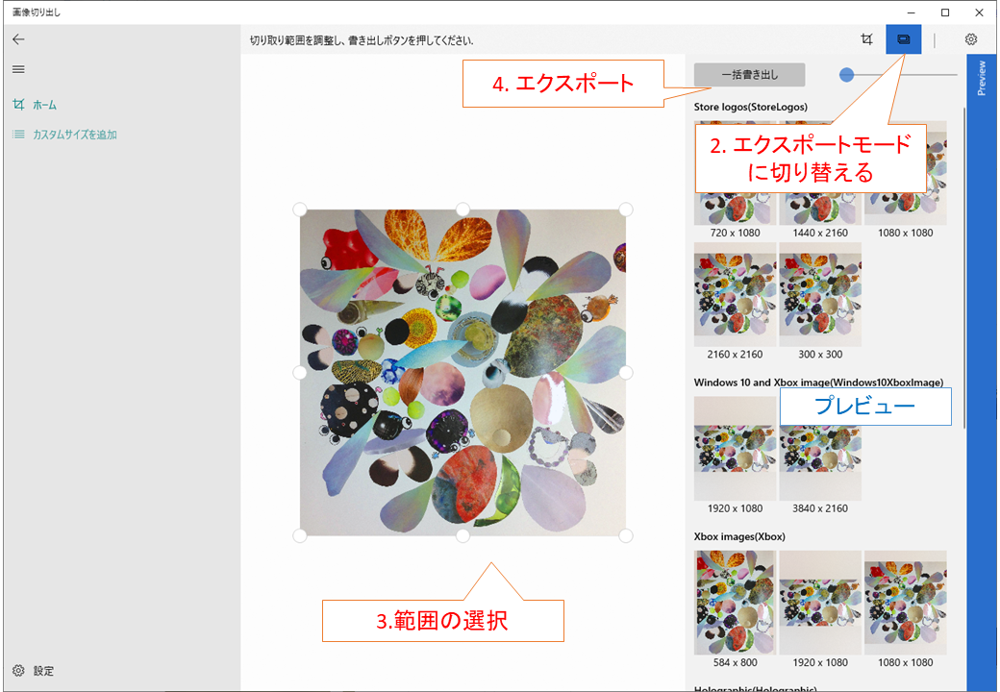
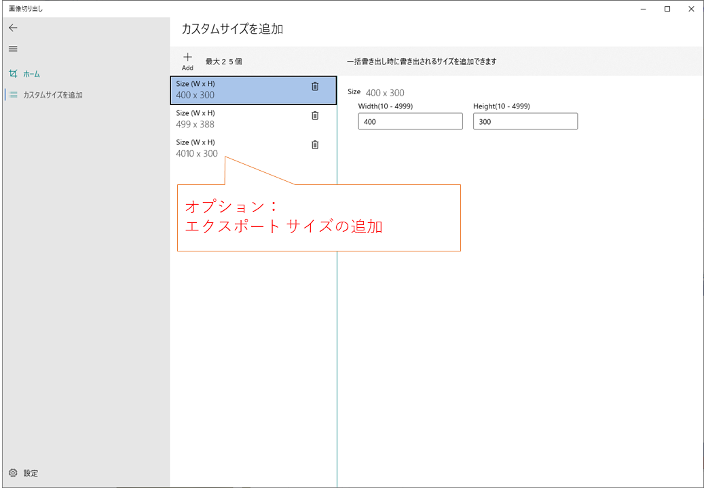
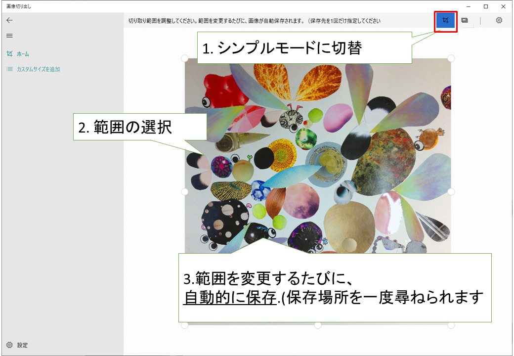
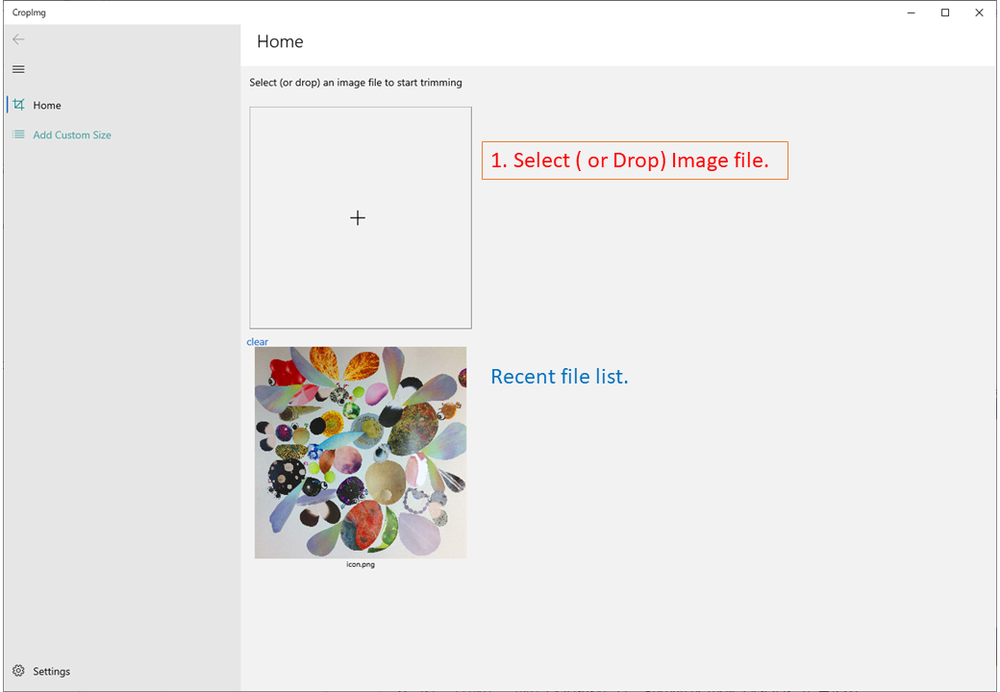
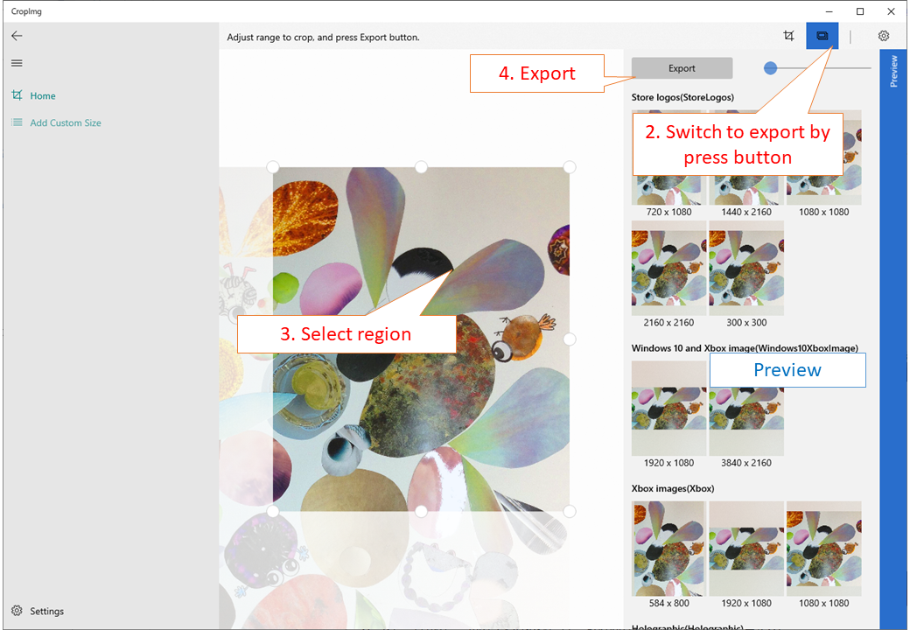
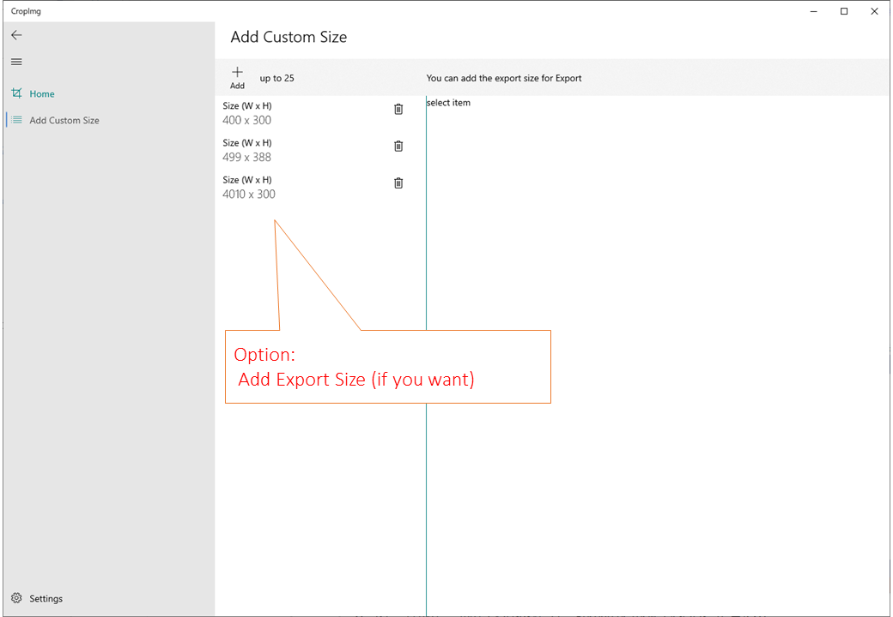
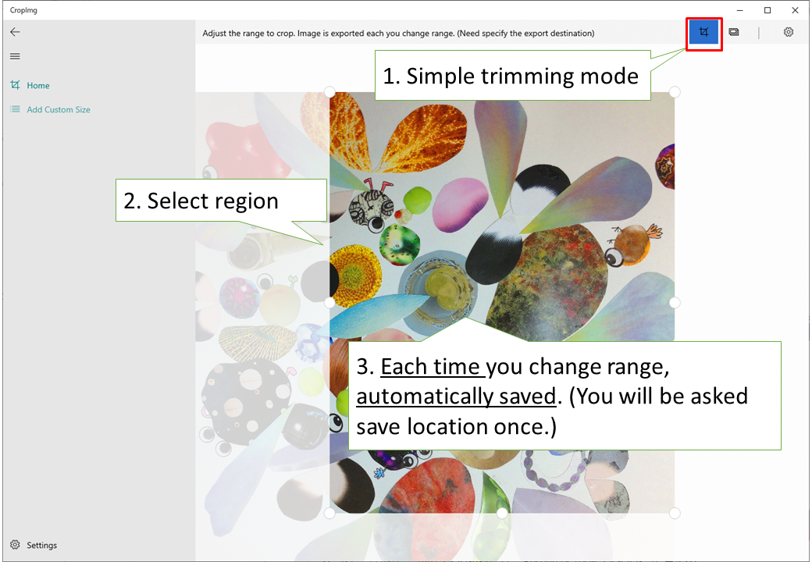

# CropImg App

- [日本語](#アプリ)
- [English](#App)

# アプリ

## 1. 固定サイズで出力

Windowsアプリ登録のダッシュボード＞ アプリ情報画面で登録する画像サイズを想定しています。

オプション: 自分でサイズを追加できます。

## 2. 自由サイズで保存

範囲を変更する毎に自動保存されます。

# App

## Fixed Ratio Export

supposes: Images for register in Microsoft-DevCenter.

Option:

## Free size save:
